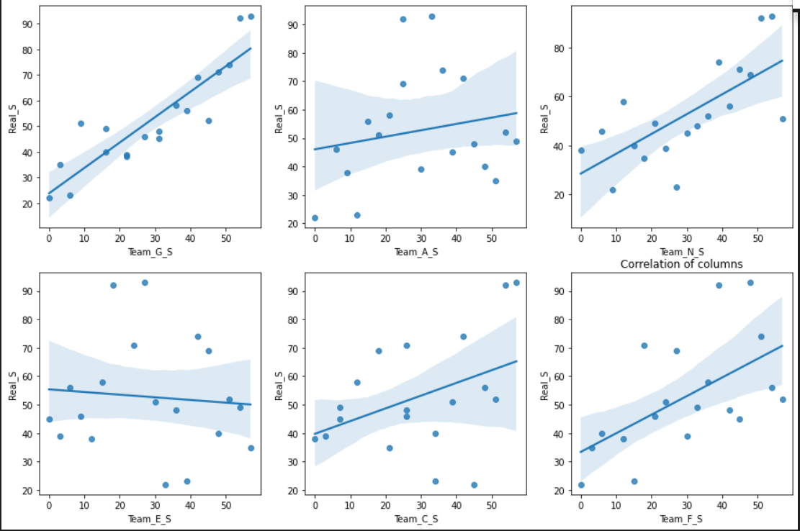
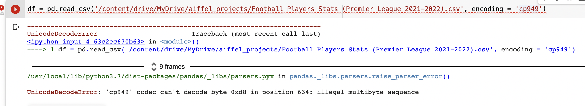
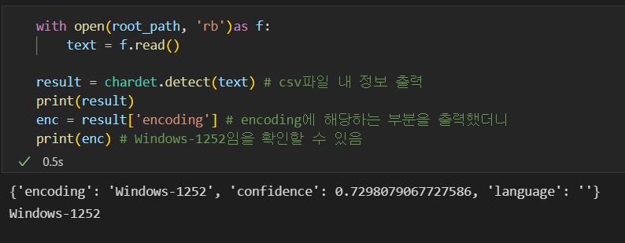
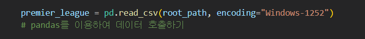

# README

# 잉글랜드 프리미어리그 선수 스탯 분석 프로젝트

# 목표 ⇒ 프로젝트를 통해 우승을 하기 위해 팀이 갖춰야 할 능력을 분석해보자!

## 👭 팀명 및 팀원

- 팀명: **밑시축**(밑바닥부터 시작하는 축구), 축구는 잘 모르지만 분석은 하고싶다!!!
- 팀장:  장준영
- 팀원:  강채연
- 팀원:  윤정덕

## 💁데이터 소개

 `[Football Players Stats (Premier League 2021-2022)](https://www.kaggle.com/datasets/omkargowda/football-players-stats-premier-league-20212022)`

- 프리미어 리그 2021~2022년도 90분당 선수 스탯 통계

### 데이터 선정 이유

- 울산 캠퍼스는 잉글랜드 프리미어리그 선수 스탯, 시험에서의 학생 성과, 넷플릭스 이렇게 3가지 중 하나를 고를 수 있었다. 그 중에서 **잉글랜드 프리미어리그 선수 스탯이 다양한 경우의 수와 결론을 도출할 수 있다고 생각했다. 그래서 해당 데이터 셋을 선정하였다.**

### 데이터 전처리 토론

- 팀별 승점 순위를 알아보기 위해서는 어떤 column들을 모으고 분석해야 하는가?
    - 순위에 영향을 줄 만한 요소 선정하기
        - 지구력 : 출전횟수(MP)와 출전 시간(Min)토대로 선수의 지구력을 수치화 해보자.
        - 나이에 따른 득점율 : 나이가 득점율에 얼마나 영향을 미치는지 조사해보자.
        - 국가에 따른 득점율 : 국가가 득점율에 얼마나 영향을 미치는지 조사해보자.
        - 카드 수 : 팀별 카드수를 계산해서 감점 요인으로 활용해보자.
        - 득점 수 : 팀별 득점수를 계산해서 득점 요인으로 활용해보자.
        - 선수의 폼 : 예상 골과 실제 골을 비교하여 선수의 폼을 수치화 해보자.
    
    - 각 컬럼을 팀 기반 데이터로 전처리 하기
        - 지구력 : 팀별 지구력을 함삽하여 평균 지구력을 계산
        - 나이에 따른 득점율 : 팀별 나이에 따른 득점율을 합산하여 계산
        - 국가에 따른 득점율 : 팀별 국가에 따른 득점율을 합산하여 계산
        - 카드 수 : 그대로 사용
        - 득점 수  : 그대로 사용
        - 선수의 폼 : 팀 별 폼 수치를 합산하여 계산
    
    - 6개의 컬럼 기반 예측 승점을 확인해보자
        - 카드 수를 제외한 나머지 컬럼을 득점 요인으로 처리
        - 카드 수는 감정 요인으로 처리
        - 팀끼리 매칭하여 이기면 3점, 비기면 1점, 지면 0점 부여
        
    - 실제 승점과 예측 승점을 각각 순위를 매겨 순위를 비교해보자
        - 실제 승점 기반 순위와 예측한 승점 기반 순위를 비교하여 전처리한 6개의 컬럼이 승점예측에 적합한지 검증해보자.

## 📊데이터 분석하기(시각화한 것을 분석)

- 주제 선정 : 풋볼 데이터 셋을 통해 우승을 하기 위해 팀이 갖춰야 할 능력을 분석해보자!
- 진행 흐름  : 팀의 승점을 위해 어떤 데이터가 필요한지 선정하고 데이터 셋을 기반으로
    - 팀 별 나이 분포에 따른 득점률,
    - 팀 별 국가 분포에 따른 득점률,
    - 팀 별 득점 수,
    - 팀 별 카드 수,
    - 팀 별 평균 지구력
    - 팀별 평균 폼
    
    위와 같이 6가지 컬럼을 만들고 해당 컬럼이 승점에 얼마나 상관 관계가 있는지 비교해보고 실제 승점과 예측한 승점은 어떤 차이를 보이는지 알아보기로 했다
    

## ****⏱️**** 결론

- 6개 컬럼에 대해 실제 순위와의 상관관계를 확인해 보았다.

- 국가별 득점율(Team_N_S)의 경우 '많은 상관관계를 보이지 않을것이다'라는 가정하에 프로젝트를 진행하였는데 그래프로 보기에 상당한 상관관계를 보여주었다.

- 지구력(Team_E_S)의 경우 생각보다 많은 관계를 보이지 않은것 같다.

- 결론적으로 실제순위와 예상순위가 많은 차이를 보이지 않아 생각보다 좋은 결과가 나온것 같다.

## 🧑‍🔬시행착오 및 대응

### 1.  colab(코랩)에서 인코딩 문제 **csv파일을 불러오기 실패**

**encoding = 'utf-8',encoding = 'cp949'로 해도 안 됨.**

### 해결

장준영 ‣ ⇒ 인코딩 확인법

윤정덕 `encoding = 'Windows-1252'`을 추가 해서 해결

### 2. 사전에 변수 명을 통일하지 않았다.

각자 컬럼을 분석하고 통합하는 과정에서 변수 명,파일 위치 등으로 인해 매끄러운 진행이 힘들었다.

### 해결 : 코드를 모으고 서로 물어보면서 변수 명을 정하고 통일했다.

## 📚 교훈과 얻은 것

- 에러는 예상치 못 한 곳에서 일어난다.
    - 파일을 합치는 과정에서 서로 변수 명이 달랐다.  데이터 톤을 하기 전에는 각자의 코딩을 모아볼 일이 없었다. 그래서 “어떻게 하면 우승팀을 맞출 수 있을까?”, “어떻게 하면 이해하기 쉬운 차트를 만들 수 있을까?”같이 데이터 활용에만 신경을 썼다.  앞으로는 기본적인 변수 명과 그 이외의 것도 고려를 하기로 했다.

- 양이 많아도 목적과 의미가 없으면 단순한 나열에 불과하다는 것을 알았다. 이를 잘 조합하고 활용을 해야 비로소 정보가 된다는 것을 알았다.

- 팀원과 함께 토론하고 모르는 것을 물어보는 게 중요하다는 것을 깨달았다. 1 일차 때 파일을 열 때 왜 안 열리는지 알 수 없었다. 혼자 끙끙 앓다가 팀원에게 물어보니 인코딩이 문제라고 알려줬고 해결할 수 있었다.